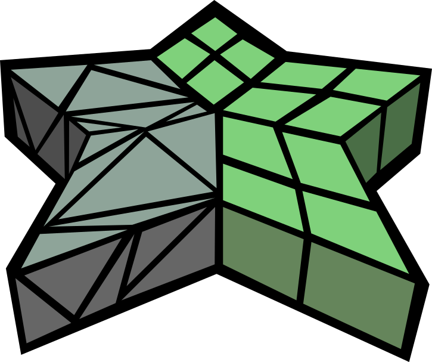

# HexHex - Highspeed Extraction of Hexahedral Meshes

{width=20% style="display: block; margin: 0 auto"}

This is the implementation of [HexHex](https://www.algohex.eu/publications/hexhex/).
Motivated by recent improvements in the generation of valid integer-grid maps (IGMs), HexHex extracts a hex mesh from a tet mesh and a locally injective(!) IGM in a fraction of the time that was required previously. Additionally, there is the option to extract piecewise-linear edge arcs and -face patches.
It is strongly based on [HexEx](https://www.graphics.rwth-aachen.de/publication/03260/) \[[Lyon et al. 2016](http://dx.doi.org/10.1145/2897824.2925976)\], which, unlike HexHex, accepts local defects in the IGM.

If you make use of HexHex in your work, we kindly ask you to cite our paper. (You can use the bibtex snippet below.)
```
@article{10.1145/3730940,
author = {Kohler, Tobias and Heistermann, Martin and Bommes, David},
title = {HexHex: Highspeed Extraction of Hexahedral Meshes},
year = {2025},
issue_date = {August 2025},
publisher = {Association for Computing Machinery},
address = {New York, NY, USA},
volume = {44},
number = {4},
issn = {0730-0301},
url = {https://doi.org/10.1145/3730940},
doi = {10.1145/3730940},
journal = {ACM Trans. Graph.},
month = jul,
articleno = {147},
numpages = {20},
keywords = {hexahedral meshing, integer-grid map, optimization} }
```

Further links:
- [Bachelor Thesis](http://cgg.unibe.ch/media/resource_files/FastHexEx-Report.pdf) (The humble beginnings)
- [OpenFlipper Plugin](https://github.com/cgg-bern/Plugin-HexHex)

## Building

### MacOS

```console
brew install cmake pkgconf jemalloc # (`jemalloc` is optional)
cmake -B build .
cmake --build build
```

This should result in a binary `./build/Build/bin/HexHex`.

## Code Usage

### Simple Use Case

To extract a Hex Mesh, simply call
```cpp
HexHex::TetrahedralMesh tetmesh = ...
HexHex::HalfFaceProp<HexHex::Vec3d> igm = ...
auto result = HexHex::extractHexMesh(tetmesh, igm);
```
using a OpenVolumeMesh as input.
In the igm property, each (non-boundary) halfface is expected to store the vertex parameter of its opposing vertex in its incident cell.

### Loading the Input from a File

The function
```cpp
bool successful_loading = HexHex::loadInputFromFile(filename, tetmesh, igm);
```
can be used to load a tet mesh and igm from a .hexex file, .ovm file, or .ovmb file.
If the mesh is loaded from a .ovm or .ovmb file, the mesh is expected to store the integer-grid map as a HalfFaceProperty<Vec3d>.


### Saving the Output to a File

The output hex mesh can be stored to the .ovm, .ovmb or to .mesh format.

```cpp
bool successful_saving = HexHex::saveOutputToFile(filename, *result.hex_mesh);
```

### Using the HexExtractor directly

You can also use the internal HexExtractor class directly. For this, you have two options.

1. OVM Tetrahedral Mesh and Template Integer Grid Map
    The igm must implement the subscript operators igm[CellHandle][VertexHandle]
    ```cpp
    HexHex::TetrahedralMesh tetmesh = ...
    IntegerGridMapT igm = ...
    HexHex::HexExtractor he(tetmesh, igm);
    auto result = he.extract();
    ```

2. OVM Tetrahedral Mesh with HalfFaceProperty
    ```cpp
    HexHex::TetrahedralMesh tetmesh = ...
    HexHex::HalfFaceProp<HexHex::Vec3d> igm = ...
    HexHex::HexExtractor he(tetmesh, igm);
    auto result = he.extract();
    ```

### Config Object

The extract methods can take in an optional config object containing some runtime parameters.

```cpp
auto config = HexHex::Config();
config.extract_piecewise_linear_edges = true; // (default false)
config.extract_piecewise_linear_edges = true; // (default false)
config.num_threads = 8; // (default 1)
...
HexHex::extractHexMesh(tetmesh, igm, config);
```

## Command Line Tool

The supported file formats for input and output are as clarified above.

Minimal use case:
```console
HexHex --in TetMesh.ovmb --out-hex HexMesh.ovmb
```

## OpenFlipper Plugin

1. **Load Parametrized Tet Mesh**
2. **Extract Hex Mesh**
